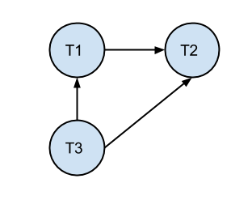
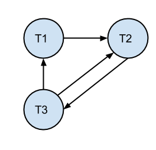

Assignment 5
============

by Josh Davis

Due: Monday, Dec 2 at 11:59

## Problem 1

### Data Structure

```java
/**
 * Basic strict 2PL class.
 */
public class TwoPhaseLock {
    /**
     * Enum for the states that lock can be in.
     */
    public enum TwoPhaseLockState {
        /** Shared state for when reading. */
        SHARED,

        /** Exclusive state for when writing. */
        NONE,

        /** Empty state for the lock. */
        EXCLUSIVE,
    }

    /** Current state of the lock. */
    private TwoPhaseLockState mState;

    /** Basic constructor for TwoPhaseLock. */
    public TwoPhaseLock() {
        // Default state is NONE
        mState = TwoPhaseLockState.NONE;
    }

    /**
     * Getter for the lock state.
     *
     * @return State of the lock
     */
    public final synchronized TwoPhaseLockState getState() {
        return mState;
    }

    /**
     * Setter for the lock state.
     *
     * @param state State to set the lock to
     */
    public final synchronized void setState(final TwoPhaseLockState state) {
        mState = state;
    }
}
```

### Implementation

```java

import TwoPhaseLock.TwoPhaseLockState;

/**
 * Basic class that represents the Object manager.
 */
public class ObjectManager {
    /** Database manager that we read from. */
    private DatabaseManager dbManager;

    /** Hashmap that represents each transaction lock. */
    private HashMap<Object, TwoPhaseLock> locks;

    /** Hashmap that represents a list of holders for the given object. */
    private HashMap<Object, List<Integer>> holders;

    /** Hashmap that represents objects being held by each transaction. */
    private HashMap<Integer, List<Object>> heldObjects;

    /**
     * Hashmap that represents a list of suspended transactions for the given
     * object.
     */
    private HashMap<Object, List<Integer>> suspended;

    /** Construct our ObjectManager. */
    public ObjectManager() {
        dbManager = new DatabaseManager();
        locks = new HashMap<Object, TwoPhaseLock>();
        holders = new HashMap<Object, List<Integer>>();
        suspended = new HashMap<Object, List<Integer>>();
    }

    /**
     * Called when a transaction wishes to read an object.
     *
     * @param tid ID of the transaction
     * @param o Object to write
     * @return Object values that was read or null if read was blocked.
     */
    public Object read(final int tid, final Object o) {
        List<Integer> holds;
        List<Integer> suspends;
        Object result;

        TwoPhaseLock lock = locks.get(o);

        // No reading going on, init all objects
        if (lock == null) {
            locks.put(o, new TwoPhaseLock());
            holders.put(o, new ArrayList<Integer>());
            suspended.put(o, new ArrayList<Integer>());
        }

        TwoPhaseLockState state = lock.getState();

        if (state == TwoPhaseLockState.EXCLUSIVE) {
            // Add ourselves to the suspenders
            suspenders.get(o).add(tid);

            // Null because read was blocked
            return null;
        } else if (state == TwoPhaseLockState.SHARED) {
            // Add ourselves to the holding list
            holders.get(o).add(tid);
        } else {
            // Set it to shared since we are reading
            lock.setState(TwoPhaseLockState.SHARED);
        }

        // Read and return our object
        return dbManager.read(o);
    }

    /**
     * Called when a transaction wishes to write an object.
     *
     * @param tid ID of the transaction
     * @param o Object to write
     * @return True if the write was allowed, false if it was blocked
     */
    public boolean write(final int tid, final Object o) {
        List<Integer> holds;
        List<Integer> suspends;
        Object result;

        TwoPhaseLock lock = locks.get(o);

        // No writing going on, init all objects
        if (lock == null) {
            locks.put(o, new TwoPhaseLock());
            holders.put(o, new ArrayList<Integer>());
            suspended.put(o, new ArrayList<Integer>());
        }

        TwoPhaseLockState state = lock.getState();

        if (state == TwoPhaseLockState.EXCLUSIVE) {
            // Add ourselves to the suspenders
            suspenders.get(o).add(tid);

            // False because write was blocked
            return false;
        } else if (state == TwoPhaseLockState.SHARED) {
            // Add ourselves to the suspenders
            suspenders.get(o).add(tid);

            // False because write was blocked
            return false;
        } else {
            // Set it to shared since we are writing
            lock.setState(TwoPhaseLockState.EXCLUSIVE);
        }

        // Write our object and be done!
        dbManager.write(o);

        return true;
    }

    /**
     * Called when a transaction wishes to commit.
     *
     * @param tid ID of the transaction
     */
    public void commit(final int tid) {
        for (Object o : heldObjects.get(tid)) {
            // Release all object locks for the given transaction
        }
    }

    /**
     * Called when a transaction wishes to abort.
     *
     * @param tid ID of the transaction
     */
    public void abort(final int tid) {
        for (Object o : heldObjects.get(tid)) {
            // Release all object locks for the given transaction
        }
    }
}
```

## Problem 2

### Part A

An example of "blind write".

Schedule:
    T1          T2
    R(X)
    W(X)
                W(X)
    R(Y)
    W(Y)
    Commit
                Commit

### Part B

Using Strict 2PL locks.

Schedule using Concurrency Control:
    T1          T2
    R(X)
    W(X)
                W(X): Not allowed
    R(Y)
    W(Y)
    Commit
                W(X): Allowed
                Commit

## Problem 3

> Correction: For problem 3a it should be Abort(T2) not Abort(T1).

### Part A

S1: R1(X), W2(X), W1(X), Abort(T2), Commit(T1)

Classification:

- Serializable?
    - Yes. Because it is identical to running T1 -> T2 or T2 -> T1 because of
      the abort of T2.
- Conflict-Serializable?
    - No. Not conflict equivalent to T1 -> T2 or T2 -> T1.
- Recoverable?
    - Yes. T1 overwrites the value of X from T2 if it aborts.
- Avoids-Cascading-Aborts?
    - Yes. T1 overwrites any value T2 wrote therefore the abort doesn't matter.
- Strict?
    - No. W of X occurs in T2 before T1 commits (releases lock on X).

### Part B

S2: R1(X), R2(X), W1(X), W2(X), Commit(T2), Commit(T1)

Classification:

- Serializable?
    - No. RW conflict between X.
- Conflict-Serializable?
    - No. Not conflict equivalent to T1 -> T2 or T2 -> T1.
- Recoverable?
    - Yes. Aborting T2 just undoes the write on X, leaving it at the value T1
      wrote. Aborting T1 doesn't matter for T2 because T2 wrote X last.
- Avoids-Cascading-Aborts?
    - Yes.
- Strict?
    - No. T2 reads X before T1 writes it after reading it.

## Problem 4

### Part A

S1: R1(X), R2(Z), R1(Z), R3(X), R3(Y), W1(X), W3(Y), R2(Y), W2(Z), W2(Y)

- Draw the Serializability Graph



- Serializable?
    - Yes, there are no cycles.

- If serializable, write down the equivalent serial schedule(s).
    - T3, T1, T2

### Part B

S1: R1(X), R2(Z), R3(X), R1(Z), R2(Y), R3(Y), W1(X), W2(Z), W3(Y), W2(Y)

- Draw the Serializability Graph



- Serializable?
    - No, there are cycles.

- If serializable, write down the equivalent serial schedule(s).
    - None.

## Problem 5

The qualifications for a strict schedule is that for any two transactions, T1,
and T2, the following holds:

- If a write of T1 precedes a conflicting operation of T2 (read or write), then
  the commit or abort of T1 precedes conflicting operation of T2.

In other words, WR and WW need to be prevented.

Considering the three types of conflicts, we can show that none can occur when
using Strict 2PL:

- RW Conflict:
    - Cannot occur because a W on an object cannot happen until the R lock is
      released.
- WW Conflict:
    - Cannot occur because the first transaction will hold the lock on the
      object therefore no other writes can happen until the first transaction
      releases it.
- WR Conflict:
    - Cannot occur because a W will cause the transaction to hold the lock until
      it is commited/aborted. Therefore no R cannot happen on other
      transactions.

Therefore it enforces strict scheduling because WR and WW are taken care of.

## Problem 6

### Part A

- D = IS
- F2 = IS
- P1200 = IS
- P1200:5 = S

### Part B

- D = IS
- F2 = IS
- P1200 = IS
- P1200:98 -> P1200:100 = S
- P1201 -> P1204 = S
- P1205 = IS
- P1205:98 -> P1205:100 = S
- P1205:1 -> P1205:2 = S

### Part C

- D = IS
- F1 = S

### Part D

- D = IS
- F1 = IS
- P500 -> P520 = S

### Part E

- D = IS
- F1 = IS
- P10 -> P980 = S

### Part F

- D = IS + IX
- F1 = SIX

### Part G

- D = IX
- F2 = IX
- P1200 = X

### Part H

- D = IX
- F1 = X
- F2 = X

### Part I

- D = IX
- F1 = X
- F2 = X
